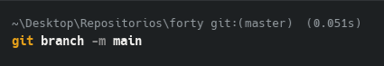

# Ejercicio Git Forty

## Trabajo en local

1. Creación de la carpeta forty
2. Renombrar master a main
    
    
    
3. Haz que los ficheros `README.txt` , `LICENSE.txt` y passwords.txt sean ignorados por el control
    
    Para ignorarlos, primero añadiremos todos los archivos al control de versiones:
    
    
    
    Despues de añadir todos los archivos:
    
    
    
4. Crea el archivo `passwords.txt`. Comprueba que el control de versiones lo ignora
    
    
    
    Aquí podemos comprobar que los archivos son ignorados:
    
    
    
    
    
5. Crea una rama llamada feature-content. Muévete a esa rama. Cambia, en la línea 3477, el font-size por 1.5em en el archivo main.css . Confirma cambios y haz commit. Muestra los logs
de la forma más gráfica posible.
    
    Hacemos el cambio en el código
    
    
    
    Y el commit, con una descripción adecuada:
    
    
    
    
    
6. Elimina el archivo `passwords.txt` en la carpeta `forty`. Verifica el estado del repositorio ¿Hay cambios pendientes?
    
    
    
    No aparecen cambios pendientes para el commit, ya que ese archivo fue añadido al gitignore previamente, por lo tanto git no lo tiene en cuenta
    
7. Crea un nuevo archivo llamado `about.html`, partiendo del archivo `generic.html` y agrégalo al repositorio., haz un nuevo commit.
    
    Añadimos el archivo a el repositorio
    
    
    
    Hacemos el nuevo commit
    
    
    
8. Cambia a la rama main . Examina los logs del repositorio de forma gráfica.
    
    
    
9. Modifica algo en el archivo generic.html , comprueba que hay cambios, y realiza otro commit .
Examina los logs del repositorio de forma gráfica.
    
    Como podemos ver, hay cambios en la rama
    
    
    
    Añadimos los cambios y hacemos el commit
    
    
    
    Vemos los logs
    
    
    
10. Mira las diferencias de elements.html . Los cambios no nos gustan, deshaz los cambios de
elements.html . Comprueba que no hay cambios pendientes.
    
    Aquí podemos ver los cambios
    
    
    
    Deshacemos los cambios en generic.html
    
    
    
11. Muestra las diferencias entre dos ramas.
    
    
    
12. Fusiona la rama "feature-content" con la rama principal (main). Muestra los logs del
repositorio de una forma gráfica y completa.
    
    
    
    Tras introducir un comentario para las razones del merge, aplicamos los cambios desde el editor, en este caso VsCode
    
13. Crea una nueva rama llamada " hotfix " y en ella, corrige un error crítico en el archivo
" index.html ". (Por ejemplo, añade el enlace a la nueva página about.html)
    
    Añadimos el cambio: 
    
    
    
    En este caso, el cambio se ha hecho en las 5 páginas, para que el menú sea siempre utilizable
    
14. Fusiona la rama "hotfix" con la rama principal y verifica el historial de commits de forma que se
vean todas las ramas gráficamente. ¿Borrarías la rama hotfix ? ¿En qué caso? ¿Cómo?
    
    
    
    La rama sería util para hacer en ella cambios rápidos a futuro sin afectar al flujo de la rama principal, así que no la borraría
    
15. Muestra el historial de cambios limitado a los últimos 3 commits.
    
    
    
16. Etiqueta el commit actual como "v1.0" y muestra las etiquetas existentes.
    
    
    

## Trabajo en remoto

1. Sube al remoto los ficheros de tu repositorio local.
Añadimos el remoto:
    
    
    
    Hacemos un push de main, las etiquetas y la rama feature content y hotfix:
    
    
    
    
    
    
    
2. En local, crea una rama 'feature-head'. Cambia el título en la sección head de index.html , borra
los comentarios del head , o previos, también. Confirma y sube los cambios al remoto.
    
    Creamos la rama y nos cambiamos a ella:
    
    
    
    Hacemos commit y despues push de los cambios:
    
    
    
    
    
3. En remoto, crea una rama 'feature-articulo'. Duplica la página generic , nómbrala como
articulo.html , y añade como contenido un artículo sobre Git. Confirma los cambios y realiza un
commit. Muestra los commits del repositorio tal como se ven en GitHub.
    
    Desde la página web de GitHub, creamos la rama simplemente escribiendo en la caja de texto
    
    
    
    Tras actualizar el repositorio local, hacemos los cambios deseados y subimos los cambios al remoto:
    
    
    
4. En el repositorio local examina los cambios. Actualiza el repositorio con el remoto. Fusiona en
'main' las dos ramas 'feature'. Crea la etiqueta 'v2.0'. Muestra los logs, commits, etiquetas y
ramas actuales, en local y en remoto
    
    Ejecturamos los siguientes comandos para:
    
    Cambiar a main
    
    Juntar una rama
    
    Juntar la otra
    
    Añadir el tag
    
    
    
5. En tu copia local, crea una rama nueva . En la rama nueva, cambia los enlaces de la página
index.html para que apunten correctamente a la nueva página articulo.html . Confirma los
cambios.
    
    Creamos la nueva rama:
    
    
    
    Confirmamos los cambios haciendo un commit:
    
    
    
6. Muestra los logs de forma que se vean las ramas en tu copia local.
    
    
    
7. Te gusta el resultado de los cambios. Incorpora los cambios de la rama nueva a la principal.
    
    Cambiamos a main y hacemos el merge de la nueva r
    
    
    
8. Sube los cambios al remoto borrando la rama nueva , si es necesario. Comprueba primero con un comando en local, las ramas que hay en el repositorio remoto.
    
    
    
9. En el repositorio en GitHub, navega hasta el archivo index.html y selecciona la opción "History".

