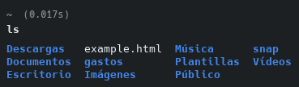

# Repaso Linux: Cap 2

1. ¿En qué directorio se encuentran los ficheros de configuración del sistema?
    
    Se encuentran en la carpeta `etc`
    
2. Para entrar en un sistema Linux hace falta a) nombre de usuario, contraseña y dirección IP, b)
nombre de usuario y contraseña o c) únicamente una contraseña..
    
    **Respuesta: b**
    
3. Muestra el contenido del directorio actual.
    
    Podemos mostrar el contenido de la carpeta actual con el comando ls
    
    ls
    
    ```bash
    $ ls
    ```
    
    
    
4. Muestra el contenido del directorio que está justo a un nivel superior.
    
    Mismo comando `ls`, pero con `../` le indicamos el directorio anterior
    
    ```bash
    $ ls ../
    ```
    
    
    
5. ¿En qué día de la semana naciste?, utiliza la instrucción cal para averiguarlo.
    
    Jueves, dia 29
    
    ```bash
    $ cal <day> <month>
    ```
    
    
    
6. Muestra los archivos del directorio /bin
    
    ```bash
    $ ls /bin
    ```
    
    
    
7. Suponiendo que te encuentras en tu directorio personal (/home/nombre), muestra un listado del
contenido de /usr/bin a) con una sola línea de comando, b) con dos líneas de comandos.
    1. En un solo paso:
        
        ```bash
        & ls /usr/bin
        ```
        
        
        
    2. En 2 comandos, primero moviendose y luego listando:
        
        ```bash
        $ cd /usr && ls bin
        ```
        
    
8. Muestra todos los archivos que hay en /etc y todos los que hay dentro de cada subdirectorio, de
forma recursiva (con un solo comando).
    
    Le indicaremos la recursividad con -R:
    
    ```bash
    $ ls -R /etc
    ```
    
    
    
9. Muestra todos los archivos del directorio /usr/X11R6/bin ordenados por tamaño (de mayor a
menor). Sólo debe aparecer el nombre de cada fichero, sin ninguna otra información adicional.
    
    ```bash
    $ ls -S /usr/bin
    ```
    
    
    
10. Muestra todos los archivos del directorio /etc ordenados por tamaño (de mayor a menor) junto
con el resto de características, es decir, permisos, tamaño, fechas de la última modificación, etc. El
tamaño de cada fichero debe aparecer en un formato “legible”, o sea, expresado en Kb, Mb, etc.
    
    ```bash
    $ ls -lhS /etc
    ```
    
    
    
11. Muestra todos los archivos del directorio /bin ordenados por tamaño (de menor a mayor).
Sólo debe aparecer el tamaño y el nombre de cada fichero, sin ninguna otra información adicional. El
tamaño de cada fichero debe aparecer en un formato “legible”, o sea, expresado en Kb, Mb, etc.
    
    
    
12. Muestra el contenido del directorio raíz utilizando como argumento de ls una ruta absoluta.
    
    ```bash
    $ ls /
    ```
    
    
    
13. Muestra el contenido del directorio raíz utilizando como argumento de ls una ruta relativa.
Suponemos que el directorio actual es /home/elena/documentos.
    
    Damos 2 pasos hacia atrás desde home/ubuntu, por ejemplo
    
    ```bash
    $ ls -la ../..
    ```
    
    
    
14. Crea el directorio gastos dentro del directorio personal.
    
    Teniendo en cuenta que ya nos encontrabamos en home/ubuntu:
    
    ```bash
    $ mkdir gastos
    ```
    
15. ¿Qué sucede si se intenta crear un directorio dentro de /etc?
    
    Se obtiene un error de permiso denegado ya que es un directorio del sistema. Si nos encontramos con un usuario root se puede hacer sin problemas.
    
    
    
16. Muestra el contenido del fichero /etc/fstab
    
    ```bash
    $ cat /etc/fstab
    ```
    


   17. Muestra las 10 primeras líneas del fichero /etc/bash.bashrc

Crea la siguiente estructura de directorios dentro del directorio de trabajo personal:
multimedia

Crea un fichero vacío dentro del directorio musica, con nombre estilos_favoritos.txt

```bash
$ mkdir -p Música && touch Música/estilos_favoritos.txt
```

Utiliza tu editor preferido para abrir el fichero estilos_favoritos.txt e introduce los
estilos de música que más te gusten. Guarda los cambios y sal.


Muestra todo el contenido de estilos_favoritos.txt

```bash
$ cat musica/estilos_favoritos.txt
```


Muestra las 3 primeras líneas de estilos_favoritos.txt

```bash
$ head -n 3 musica/estilos_favoritos.txt
```

Muestra la última línea de estilos_favoritos.txt

```bash
$ tail -n 1 musica/estilos_favoritos.txt
```


Muestra todo el contenido del fichero estilos_favoritos.txt excepto
la primera línea. Se supone que no sabemos de antemano el número de líneas del fichero.

```bash
$ tail -n +2 musica/estilos_favoritos.txt
```

